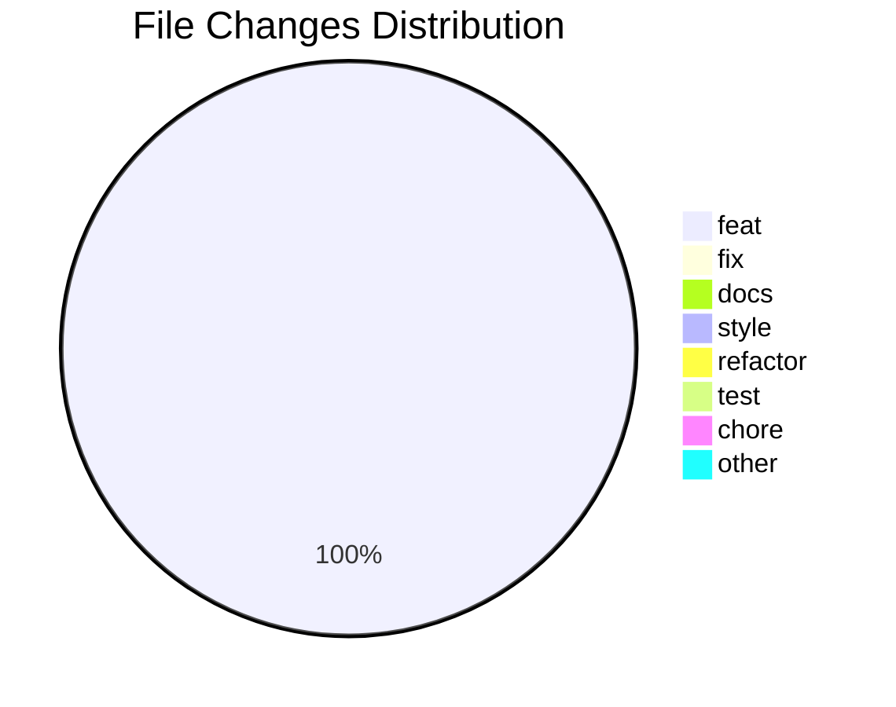

## 📝 

### Commits

- [feat(navbarComponent): add navigation menu](https://github.com/camyacodes/code-tracking/blob/main/LearningBehindTheScreens/4/24/2025/22%3A32%3A03-2.md)

### 📈 Productivity Metrics
- Total Commits: 1
- Lines Per Hour: 53
- Most Frequent Frequency: 2.0

## 📈 Visual Representation

